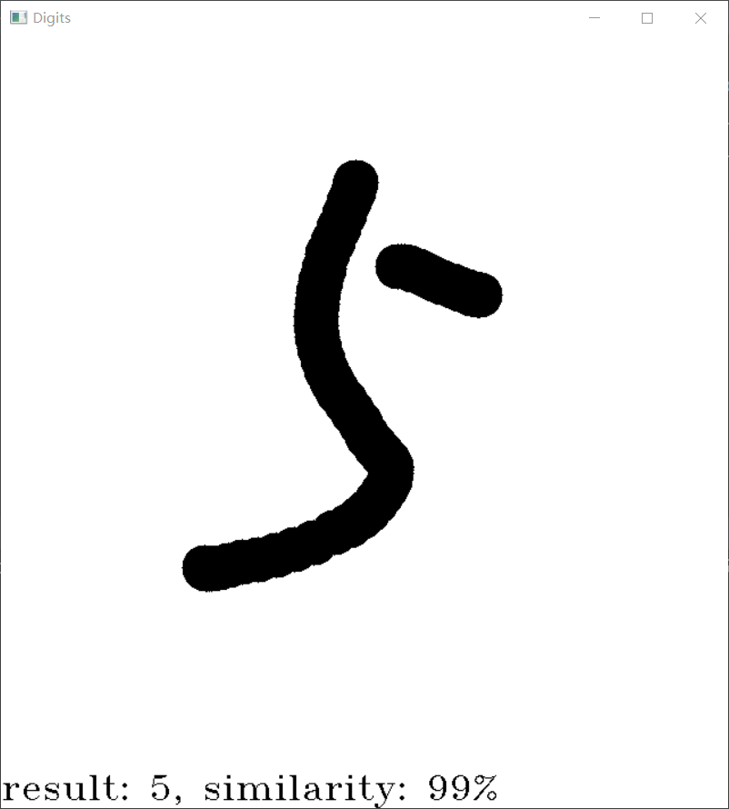

[English](../README.md) | __简体中文__

# 手写数字识别

## 简介

本项目是我的大二Python程序设计课程的期末作业，项目内容包括：

[PyTorch]: https://pytorch.org/ "PyTorch"

* 使用[PyTorch]搭建[LeNet](https://ieeexplore.ieee.org/document/726791)神经网络；
* 在[MNIST数据集](https://yann.lecun.com/exdb/mnist/)上训练LeNet神经网络；
* 编写一个手写数字识别应用程序。

## 文件结构

```
Digits
├── data              # 数据集文件夹
├── docs              # 项目文档文件夹
    ├── images        # 图片文件夹
        └── demo.png
    └── README_cn.md  # 中文说明文件
├── model             # 模型代码包
    └── __init__.py   # LeNet模型代码
├── setup.py          # 安装程序
├── LICENSE           # LICENSE文件
├── main.py           # 手写数据识别应用程序
├── README.md         # 英文说明文件
├── requirements.txt  # 依赖库列表
└── train.py          # 训练程序
```

## 快速开始

### 1.克隆项目

```shell
git clone https://github.com/Yue-0/Digits.git
cd ./Digits
```

### 2.安装依赖

```shell
sh install.sh
```

### 3.训练模型

```shell
python train.py
```

* 默认使用CPU进行训练和部署；
* 训练超参数定义在[train.py](../train.py)的第96~98行：
```python
LR = 1e-4   # 学习率
EPOCH = 20  # epochs
BATCH = 64  # batch size
```

### 4.运行手写数字识别应用程序

```shell
python main.py
```

运行主程序后，会出现一个白板。按住鼠标左键即可在白板上写字，
松开鼠标左键后，程序将自动识别白板上的数字，并将识别结果显示
在白板下方，如下图所示（_目前仅支持识别一个数字_）：



按下鼠标右键即可清空白板。
